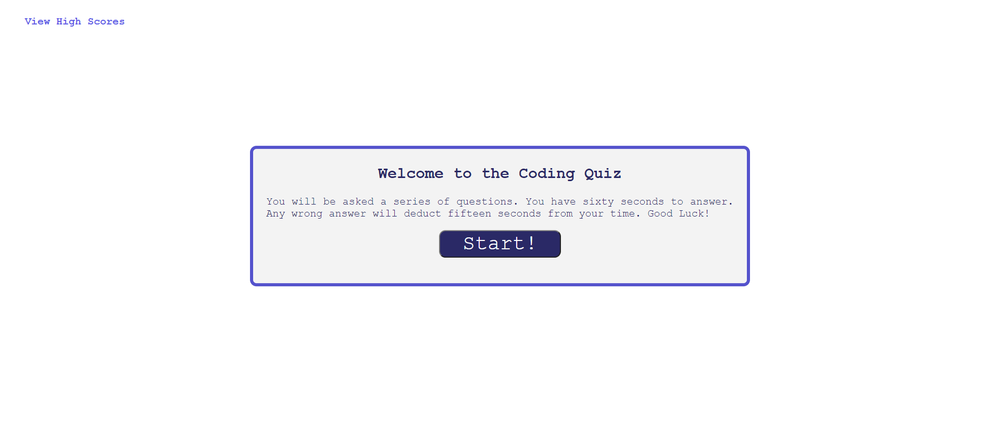
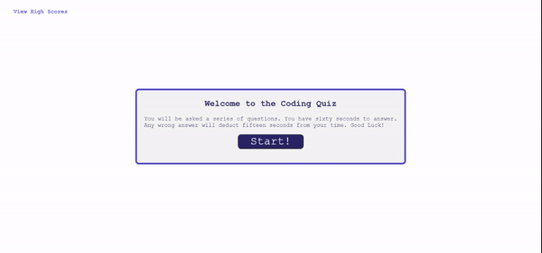

# Code Quiz

https://chris-backes.github.io/code-quiz/





## User Story

```
AS A coding boot camp student
I WANT to take a timed quiz on JavaScript fundamentals that stores high scores
SO THAT I can gauge my progress compared to my peers
```

## Acceptance Criteria

```
GIVEN I am taking a code quiz
WHEN I click the start button
THEN a timer starts and I am presented with a question
WHEN I answer a question
THEN I am presented with another question
WHEN I answer a question incorrectly
THEN time is subtracted from the clock
WHEN all questions are answered or the timer reaches 0
THEN the game is over
WHEN the game is over
THEN I can save my initials and score
```

## Components

The webpage is made up of an HTML file, a CSS file, and a JavaScript file. The file itself contains, in addiotn, this README and an image used for the favicon.

### HTML

The HTML is two pages, whose elements, excluding those on the landing page of the index, are dynamically created in JavaScript.

### CSS

The styling on this, while minimal, styles not just those images which populate the page when it first appears, but those elements dynamically created in the course of the quiz

### JavaScript

The Javascript is composed of functions which are called in succession after the user hits the start button. The start button calls the function throug onclick, while the remaining buttons use and addEventListener

The first function starts a timer and calls the first question. The three buttons populating the first question each call a function to check the answer, as well as call the next question. This is repeated until the fifth question, after which the function dynamically creating the end game content is called.

The high score page introduces a form for inputing initials. These initials will be stored with the score itself in the local storage.

The scoring page is displayed on a second page, which is linked both in the upper left of the index and is automatically produced upon completing the form submitting the score. The contents of the page are a table of all the scores stored in local storage.
